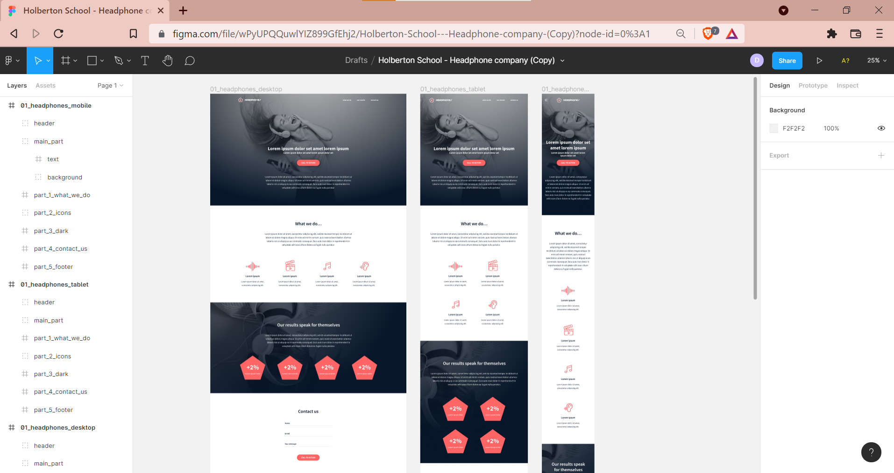
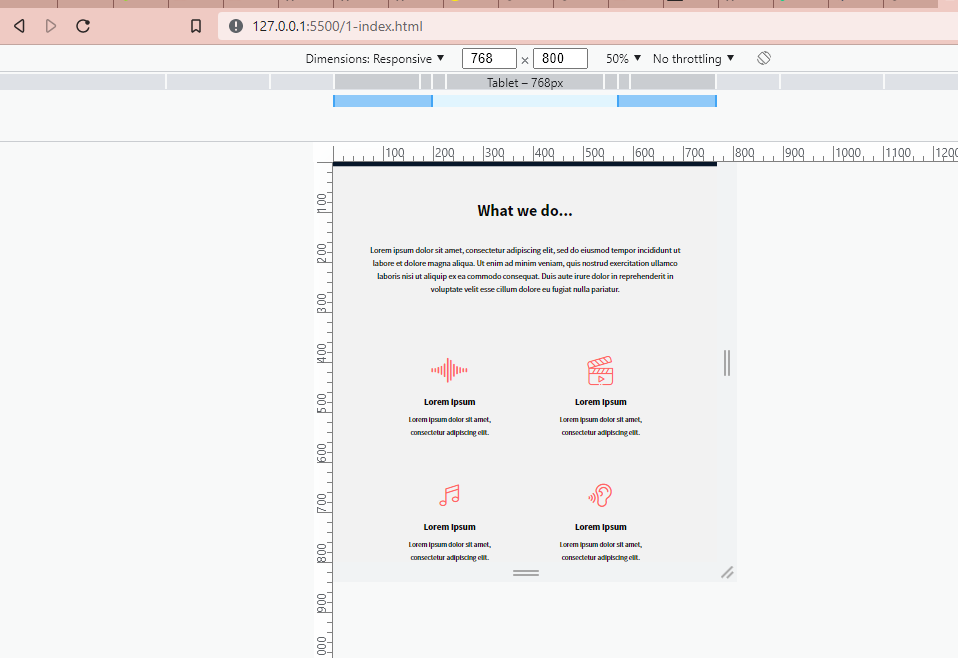
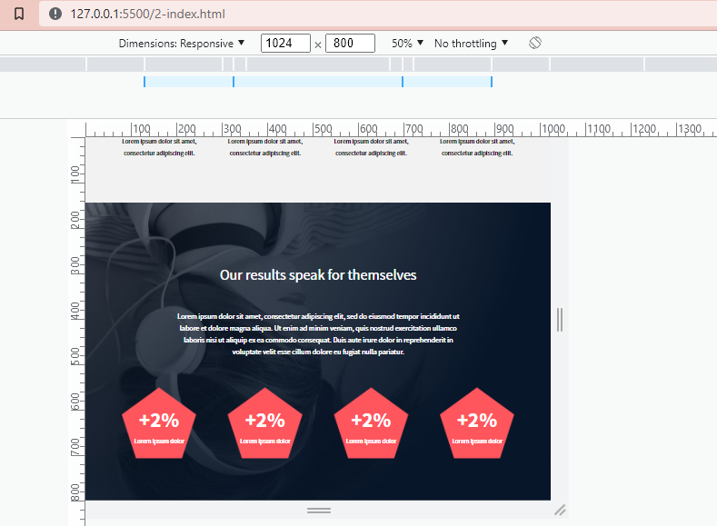

# 0x09. Implement a design from scratch

*In this project, you will implement from scratch, without any library, a web page. You will use all HTML/CSS/Accessibility/Responsive design knowledges that you learned previously.*

Here the final result:

### :desktop_computer: Desktop

    

### :iphone: Mobile

    

### :pager: Tablet

    

## Tasks
**:bulb: [0. Read and be familiar with Figma](README.md)**

**Interactions note:**

- the web page must switch to the mobile version when the screen width is 480px or less

- links hover/active: #FF6565

- button hover/active: opacity: 0.9

- max width of the content: 1000px centered in the page

 

**:bulb: [1. Header](0-index.html)**

Building a web page the right way, is not easy - expect if you put in place strong foundations:

- reset CSS styling

- use variables

- simple/“as generic as you can” CSS selectors

- avoid using super specific CSS selectors as much as possible

- simple HTML structure - div containers are your friend!

For this first task: **create the header/hero piece**

**Desktop:**

**Mobile:**

 

**:bulb: [2. "What we do..." section](1-index.html)**

In this section, you will need custom font icons. Here the archive of it: [holberton_school-icon](holberton_school-icon)

 

**:bulb: [3. "Our results" section](2-index.html)**

